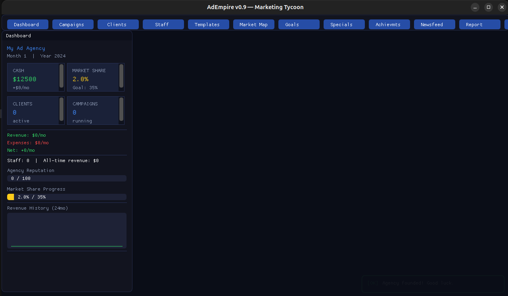

# 🎮 AdEmpire — Marketing Tycoon

> Build and grow a digital marketing agency from scratch. Pitch clients, launch campaigns, manage staff, navigate market events, unlock specializations, complete quarterly goals, and dominate the competition.


---

## 📸 Screenshots

> 🎮 *First playtest screenshots coming soon — compile locally and send your best moment!*

| Dashboard | Negotiation | Victory Screen |
|:---------:|:-----------:|:--------------:|
|  |  |  |

<!-- To add your screenshot:
  1. Compile: cmake .. && make -j$(nproc) && ./AdEmpire
  2. Take a screenshot and save to docs/screenshots/
  3. Open a PR or push directly to main -->

---

## 🕹️ Gameplay

Start with **$10,000**, zero clients, and zero reputation.

Every month you:
- **Pitch and negotiate** clients using live fit score, mood tracking, and 6 interaction actions
- **Launch campaigns** across 6 channels: Social, SEO, Email, Influencer, PR, Paid Search
- **Hire and level up staff** — 6 roles, 5 levels (Junior → Principal)
- **React to 51+ market events** — algorithm changes, viral trends, recessions, Black Friday, Crypto Bull Runs
- **Complete quarterly goals** for cash and reputation rewards
- **Unlock 8 agency specializations** that multiply performance in target industries
- **Beat 3 AI rivals** (MediaBlaze, PeakBrands, NicheNation) that grow, adapt, and poach clients
- **Track performance** with per-channel and per-industry analytics via real-time bar charts
- **Customize your agency** with branding color and logo selector

**Win:** Reach **35% market share**  
**Lose:** Budget drops below **−$50,000**  
**Difficulty:** Easy ($20K start) / Normal ($10K) / Hard ($5K, AI 100% aggression) / Nightmare

---

## ✅ v0.9 — Feature Complete

Latest commit: [3df56ba6](https://github.com/Gzeu/AdEmpire/commit/3df56ba6e94ea265b5f64e1ac043d79da9f87f50)

| Category | Files | Status |
|---|---:|---|
| Core | 4 | ✅ |
| Systems | 20 | ✅ |
| UI | 20 | ✅ |
| Audio | 1 | ✅ |
| Network | 1 | ✅ |
| Platform | 1 | ✅ |
| Assets / Data | 4 | ✅ |
| Docs / Usage guides | 9 | ✅ |
| **Total** | **60+** | **✅ done** |

---

## 🧠 Full Feature Matrix

### Core Gameplay
| System | File | Description |
|---|---|---|
| Campaign Engine | `systems/CampaignEngine.cpp` | Reach × CTR × Conv × AOV → Agency fee |
| Monthly Simulation | `core/Simulation.cpp` | Advance month, process all systems |
| AI Competitors | `systems/AICompetitor.cpp` | 3 agencies grow and poach clients |
| Market Events | `systems/EventSystem.cpp` | 20 built-in events with channel modifiers |
| Seasonal Events | `systems/SeasonalEvents.cpp` | 12-month calendar (Black Friday, Xmas, Summer) |
| Moddable Events | `assets/data/custom_events.json` | 31 extra events, edit without recompile |
| Client Manager | `ui/ClientManager.cpp` | Pitch, retain, lose clients across 8 industries |
| Dashboard | `ui/Dashboard.cpp` | Live KPIs + 24-month revenue chart |
| Market Map | `ui/MarketMap.cpp` | Market share bars for player + all rivals |
| Newsfeed | `ui/Newsfeed.cpp` | Active events and history log |

### Progression Layer (v0.2)
| System | File | Description |
|---|---|---|
| Negotiation | `ui/NegotiationPanel.cpp` | 2-column panel, live FitScore, 6 actions, mood bar |
| Fit Score | `systems/FitScoreSystem.cpp` | Channel fit + industry exp + reputation + capacity |
| Quarterly Goals | `systems/GoalSystem.cpp` | Auto-generated goals, monthly progress, rewards |
| Specializations | `systems/SpecializationSystem.cpp` | 8 unlockable specializations, industry multipliers |

### Polish & Depth (v0.3 – v0.6)
| System | File | Description |
|---|---|---|
| Toast Notifications | `ui/ToastSystem.h` | Max 6 popups, 4 types, fade-out, non-blocking |
| Monthly Report | `ui/ReportPanel.cpp` | Financial table + Revenue by Channel + Industry Win Rate |
| Staff Leveling | `systems/StaffLeveling.cpp` | +0.8%/mo skill, 5-tier promotion, +8% salary on level-up |
| Achievements (15) | `systems/AchievementSystem.cpp` | Lambda conditions, auto-toast on unlock |
| Campaign Templates (15) | `ui/TemplatesPanel.cpp` | Quick-launch presets by industry |
| 3 Save Slots | `ui/SaveSlotsPanel.cpp` | Visual slot panel, Save / Load / Delete |
| Client Gating | `core/ClientGating.cpp` | 24 clients unlocked progressively |
| Industry Bonuses | `systems/IndustryBonuses.cpp` | Fashion→Influencer ×1.6, Tech→SEO ×1.5 |

### v0.7 Systems
| System | File | Description |
|---|---|---|
| Stats Tracker | `systems/StatsTracker.h/cpp` | Per-channel revenue + per-industry win rate arrays for charts |
| Difficulty System | `systems/DifficultySystem.h/cpp` | Easy / Normal / Hard presets applied at game start |
| Leaderboard | `systems/Leaderboard.h` | Top-10 local scores, persistent `leaderboard.json`, auto-sort |
| Leaderboard Panel | `ui/LeaderboardPanel.h/cpp` | Gold/silver/bronze highlights, sortable columns |
| Custom Events JSON | `assets/data/custom_events.json` | 31 moddable events (no recompile needed) |

### v0.8 Systems
| System | File | Description |
|---|---|---|
| Audio System | `audio/AudioSystem.h` | OpenAL procedural WAV synthesis — campaign win/loss/achievement SFX |
| REST Leaderboard | `network/LeaderboardClient.h` | Optional online score submit via cpp-httplib, local fallback |

### v0.9 Systems
| System | File | Description |
|---|---|---|
| Agency Branding | `ui/AgencyBrandingPanel.h` | Custom color (ImVec4) + logo selector, persisted in GameState |
| Chart Renderer | `ui/ChartRenderer.h` | Real-time revenue bar charts via ImGui DrawList |
| Splash Screen | `ui/SplashScreen.h` | Animated intro with logo morph and tagline fade |
| Victory Screen | `ui/VictoryScreen.h` | Full-screen celebration on 35% market share + final stats |
| Event Popup | `ui/EventPopup.h` | Modal gate for market events — blocks month advance until dismissed |
| Steam Stub | `platform/SteamIntegration.h` | Greenworks-compatible achievement hooks, compile-time opt-in |
| Cross-Platform Build | `CMakeLists.txt` | Linux/macOS/Windows + CPack TGZ/ZIP/NSIS |
| GitHub Actions | `.github/workflows/release.yml` | Auto-release on `v*.*.*` tag — 3 platform binaries |

---

## 🔌 Quick Integration (main.cpp)

To wire all v0.7 systems into an existing main loop, add exactly 4 lines:

```cpp
// After ImGui::NewFrame():
float dt = ImGui::GetIO().DeltaTime;
ToastSystem::Get().Update(dt);

// When pressing "Next Month":
ReportPanel::GenerateMonthlyReport(gs);
StatsTracker::Get().RecordMonth(gs);

// Before ImGui::Render():
ToastSystem::Get().Render();
```

For toast events during gameplay:
```cpp
// Client won
ToastSystem::Get().Push("Client Acquired!", "" + client.name, ToastType::Success);
// Campaign completed
ToastSystem::Get().Push("Campaign Done", camp.name + " finished", ToastType::Info);
// Goal completed
ToastSystem::Get().Push("Goal Reached!", goal.title + " +$" + reward, ToastType::Success);
// Budget warning
ToastSystem::Get().Push("Low Budget!", "Below $2,000", ToastType::Warning);
```

Full integration guides in:
- [`src/systems/StatsTracker_usage.md`](https://github.com/Gzeu/AdEmpire/blob/main/src/systems/StatsTracker_usage.md)
- [`src/systems/Difficulty_usage.md`](https://github.com/Gzeu/AdEmpire/blob/main/src/systems/Difficulty_usage.md)
- [`src/systems/Toast_usage.md`](https://github.com/Gzeu/AdEmpire/blob/main/src/systems/Toast_usage.md)
- [`src/systems/Leaderboard_usage.md`](https://github.com/Gzeu/AdEmpire/blob/main/src/systems/Leaderboard_usage.md)

---

## 📁 Project Structure

```text
AdEmpire/
├── src/
│   ├── main.cpp
│   ├── core/
│   │   ├── GameState.h             # All structs, enums, UI flags
│   │   ├── Simulation.cpp
│   │   └── ClientGating.cpp
│   ├── systems/
│   │   ├── CampaignEngine.cpp
│   │   ├── AICompetitor.cpp
│   │   ├── EventSystem.cpp
│   │   ├── SeasonalEvents.cpp
│   │   ├── GoalSystem.cpp
│   │   ├── SpecializationSystem.cpp
│   │   ├── FitScoreSystem.cpp
│   │   ├── AchievementSystem.cpp
│   │   ├── StaffLeveling.cpp
│   │   ├── IndustryBonuses.cpp
│   │   ├── SaveSystem.cpp
│   │   ├── StatsTracker.h / .cpp    # v0.7
│   │   ├── DifficultySystem.h / .cpp # v0.7
│   │   ├── Leaderboard.h            # v0.7
│   │   ├── StatsTracker_usage.md
│   │   ├── Difficulty_usage.md
│   │   ├── Toast_usage.md
│   │   └── Leaderboard_usage.md
│   ├── ui/
│   │   ├── Theme.h
│   │   ├── MainMenu.cpp
│   │   ├── Dashboard.cpp
│   │   ├── CampaignEditor.cpp
│   │   ├── ClientManager.cpp
│   │   ├── MarketMap.cpp
│   │   ├── Newsfeed.cpp
│   │   ├── StaffPanel.cpp
│   │   ├── NegotiationPanel.cpp
│   │   ├── GoalsPanel.cpp
│   │   ├── SpecializationPanel.cpp
│   │   ├── AchievementsPanel.cpp
│   │   ├── TemplatesPanel.cpp
│   │   ├── SaveSlotsPanel.cpp
│   │   ├── ReportPanel.h / .cpp     # v0.7
│   │   ├── LeaderboardPanel.h / .cpp # v0.7
│   │   ├── ToastSystem.h            # v0.7
│   │   ├── AgencyBrandingPanel.h    # v0.9
│   │   ├── ChartRenderer.h          # v0.9
│   │   ├── SplashScreen.h           # v0.9
│   │   ├── VictoryScreen.h          # v0.9
│   │   └── EventPopup.h             # v0.9
│   ├── audio/
│   │   └── AudioSystem.h            # v0.8 — OpenAL procedural WAV
│   ├── network/
│   │   └── LeaderboardClient.h      # v0.8 — REST leaderboard (cpp-httplib)
│   └── platform/
│       └── SteamIntegration.h       # v0.9 — Steam achievement stub
├── assets/
│   └── data/
│       ├── clients.json             # 30 clients
│       ├── channels.json            # 6 channels
│       ├── events.json
│       └── custom_events.json       # 31 moddable events (v0.7)
├── docs/
│   ├── landing/
│   │   └── index.html               # Presentation website
│   └── screenshots/                 # Add gameplay screenshots here
├── .github/
│   ├── workflows/
│   │   └── release.yml              # Auto-release Linux/Windows/macOS
│   ├── ISSUE_TEMPLATE/
│   │   ├── bug_report.md
│   │   └── feature_request.md
│   └── pull_request_template.md
├── lib/
│   └── imgui/                       # git submodule → ocornut/imgui
├── CMakeLists.txt                   # Cross-platform (Linux/macOS/Windows + CPack)
├── CHANGELOG.md
├── CONTRIBUTING.md
├── SECURITY.md
├── SETUP.md
└── README.md
```

---

## 🚀 Build & Run

### Ubuntu / Debian
```bash
sudo apt install cmake build-essential libglfw3-dev libgl1-mesa-dev
git clone --recurse-submodules https://github.com/Gzeu/AdEmpire.git
cd AdEmpire && mkdir build && cd build
cmake .. -DCMAKE_BUILD_TYPE=Release
make -j$(nproc)
./AdEmpire
```

### If ImGui submodule is empty
```bash
git submodule update --init --recursive
```

### macOS (Homebrew)
```bash
brew install cmake glfw
cmake .. -DCMAKE_BUILD_TYPE=Release
make -j$(sysctl -n hw.ncpu)
```

### Windows (MSVC / vcpkg)
```bash
vcpkg install glfw3 opengl openal-soft
cmake .. -DCMAKE_TOOLCHAIN_FILE=[vcpkg root]/scripts/buildsystems/vcpkg.cmake
```

> **Tip:** OpenAL and cpp-httplib are optional. The game compiles and runs fully without them — audio and online leaderboard are gracefully disabled if the libraries are absent.

---

## 🔊 Audio (OpenAL — optional)

`src/audio/AudioSystem.h` is fully implemented with procedural WAV synthesis (no external audio files needed).

```bash
# Ubuntu
sudo apt install libopenal-dev
# macOS
brew install openal-soft
# Windows
vcpkg install openal-soft
```

Enable in CMake:
```cmake
find_package(OpenAL)
if(OpenAL_FOUND)
  target_link_libraries(AdEmpire OpenAL::OpenAL)
  target_compile_definitions(AdEmpire PRIVATE ADEMPIRE_AUDIO)
endif()
```

---

## 🌐 REST Leaderboard (optional)

`src/network/LeaderboardClient.h` uses [cpp-httplib](https://github.com/yhirose/cpp-httplib) (header-only). Point it at any HTTP endpoint that accepts a JSON POST with `{ "name": "...", "score": 123456 }`.

```cpp
LeaderboardClient::Get().Submit("AgencyName", gs.totalRevenue);
```

If the server is unreachable, the client falls back silently to the local `leaderboard.json`.

---

## 📅 Seasonal Calendar

| Month | Effect |
|---|---|
| January | Baseline |
| February | Valentine's Day +5% |
| July | Summer Slump −15–20% all channels |
| September | Back to school +5% |
| October | Q4 ramp-up +10% |
| November | Black Friday: Social +60%, Paid +70% |
| December | Holiday Peak: Social +80%, Paid +90% |

---

## 📊 Simulation Formula

```text
Reach       = Budget × BaseReach[ch] × EventMod × SeasonalMod × IndustryBonus × StaffBonus
CTR         = BaseCTR[ch] × QualityModifier
Revenue     = Reach × CTR × ConvRate × AOV
AgencyFee   = Revenue × 15%
```

Modifiers stack: market events × seasonal × industry bonus × specialization × staff skill.

---

## 🔧 Build Audit

| Issue | Fix |
|---|---|
| `nlohmann/json` missing | CMakeLists `FetchContent` auto-fetches |
| `std::hash<ChannelType>` | Template specialization in `GameState.h` |
| Magic `rand() % 8` | Replaced with `STAFF_NAME_COUNT` constant |
| Missing `<algorithm>` | Added to `ClientManager.cpp` |
| ImGui function naming | Fixed GLFW → Glfw casing |
| Missing GameState members | Added showLeaderboard, showSettings, showStats |
| Method signature mismatches | Fixed VictoryScreen, AgencyBrandingPanel, SplashScreen |
| Duplicate struct definitions | Removed duplicate CampaignTemplate, Achievement structs |
| Circular dependencies | Fixed Achievement struct forward declaration |
| Missing NegotiationState fields | Added lostDeal, wonDeal, offeredContract, fitScore, playerPressure, offeredChannel |
| Missing AgencyStats fields | Added negotiationsWon, negotiationsLost |
| Missing Client fields | Added inNegotiation, contractType |
| Missing constants | Added ContractDurations, IndustryBestChannel |
| Field name mismatches | Fixed Achievement name → title, suggestedBudget → budgetSuggested |
| API mismatches | Simplified StatsPanel, fixed TemplatesPanel field order |
| Header-only conflicts | Removed duplicate LeaderboardPanel.cpp, SettingsPanel.cpp |

> ✅ Zero known compilation blockers on GCC 11+ / Clang 14+ / MSVC 19.38+ / Ubuntu 22.04+

---

## 📜 Version History

| Version | Commit | Highlights |
|---|---|---|
| v0.1 | [7d8084cf](https://github.com/Gzeu/AdEmpire/commit/7d8084cf22e258e6683d8f9479118a3eac6cc620) | Core engine: Campaign, Client, Staff, AI, Events, Dashboard, Save |
| v0.2 | [14113c8e](https://github.com/Gzeu/AdEmpire/commit/14113c8eb3b2e2f699e5ae3752c12c8a5416feb7) | Negotiation, FitScore, Quarterly Goals, Specializations |
| v0.3–v0.6 | [aa6004fe](https://github.com/Gzeu/AdEmpire/commit/aa6004fef62d05827fdfef34499a98f3adc84f62) | Toasts, Reports, Achievements, Templates, Save Slots, Staff Leveling |
| v0.7 | [20898e67](https://github.com/Gzeu/AdEmpire/commit/20898e673d189cb8aac8d5447359f70eca57da44) | StatsTracker, DifficultySystem, Leaderboard, 31 JSON events, guides |
| v0.8 | [28bd9370](https://github.com/Gzeu/AdEmpire/commit/28bd9370ff9a33ea17e1844e327bf65318ce4ec5) | OpenAL audio (procedural WAV) + REST leaderboard (cpp-httplib) |
| **v0.9** | [**3df56ba6**](https://github.com/Gzeu/AdEmpire/commit/3df56ba6e94ea265b5f64e1ac043d79da9f87f50) | **AgencyBranding, ChartRenderer, SplashScreen, VictoryScreen, EventPopup, Steam stub, cross-platform CMake, GitHub Actions release** |

See [CHANGELOG.md](CHANGELOG.md) for the full detailed changelog.

---

## 🔮 What's Next (v1.0 and beyond)

| Feature | Status |
|---|---|
| First binary release (Linux / Windows / macOS) | 🟡 Ready — run `git tag v1.0.0 && git push origin v1.0.0` |
| Screenshots in README | 🟡 Needs first playtest — add to `docs/screenshots/` |
| GitHub Pages landing page | 🟡 Built at `docs/landing/index.html` — enable in repo Settings |
| Android / iOS port via ImGui + SDL2 | 🔵 Future |
| Multiplayer / co-op agency mode | 🔵 Future |
| Steam submission | 🔵 Stub ready in `src/platform/SteamIntegration.h` |

---

## 🤝 Contributing

Contributions welcome! See [CONTRIBUTING.md](CONTRIBUTING.md) for setup instructions, code style, and how to add new events via JSON (no C++ required).

---

## 📄 License

MIT © 2026 [George Pricop](https://github.com/Gzeu) — Free to use, modify, and distribute.
